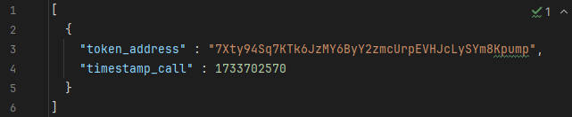
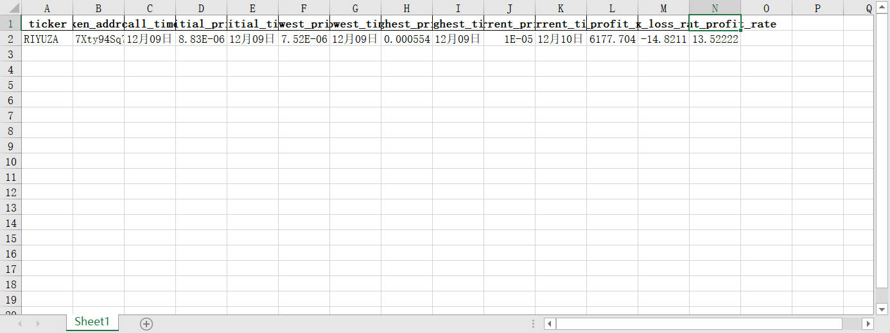

**引流**

- [推特](https://x.com/bbbaaahhh200)
- [chain.fm 频道](https://chain.fm/channel/1305381392003109041)
- [限免tg交流、警报频道](https://t.me/+LxkxI6PylzMzYjAy)

## ❗️警告：请你在熟悉代码，或在ai的指导下检查代码无恶意的情况下运行。小心我把你的钱拿走

### 👉快速开始

**回测喊单的整个流程：喊单记录 --> 回测 --> 回测记录**

**本项目只帮助你做后两者，喊单记录需要你自己记录（程序化或手动化）**

1. 记录的内容格式：代币的合约地址，时间戳（UTC+0），然后填入 call.json 文件中，详见



2. 当你填写好之后，你需要抓取 bullx 的 token，因为我们要请求 k 线数据


填入：

```
API_TOKEN = ""
```

3. 运行 main.py

4. 结果会输出到 output.xlsx（时间我已经自己加成UTC+8了）

